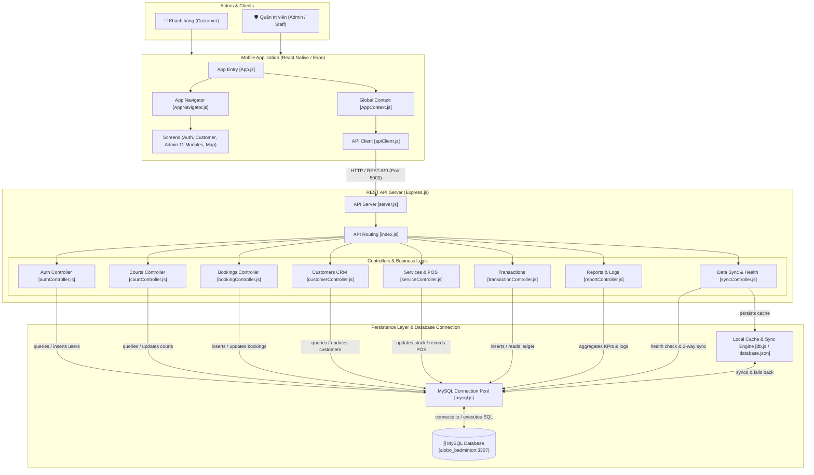

# 🏸 Badminton Court Booking & Management System (Alobo Sport)

Hệ thống quản lý và đặt sân cầu lông chuyên nghiệp được tổ chức theo kiến trúc **2 Module độc lập: Backend & Frontend**.

---

## 🏛️ Sơ Đồ Kiến Trúc Hệ Thống (System Architecture & Database Connections)



```
24CT1-Tran_Quoc_Trung/
│
├── 📂 backend/                     # MODULE 1: REST API SERVER (Node.js & Express)
│   ├── src/
│   │   ├── config/                 # MySQL Pool (mysql.js) & Local Cache Store (db.js)
│   │   ├── controllers/            # Xử lý nghiệp vụ & Query SQL MySQL
│   │   ├── data/                   # Script MySQL Workbench & database.json
│   │   ├── middlewares/            # Auth JWT, Logger, Error Handler
│   │   ├── routes/                 # REST API Endpoints Router
│   │   └── server.js               # Entry point Express Server (Port 5000)
│   ├── package.json
│   └── README.md
│
├── 📂 frontend/                    # MODULE 2: CLIENT APP (React Native / Expo)
│   ├── App.js                      # Root React Native Component
│   ├── src/
│   │   ├── api/                    # Tầng giao tiếp REST API & apiClient.js
│   │   ├── components/             # Reusable UI Components (Common, Auth, Map)
│   │   ├── constants/              # Design System Theme & Assets
│   │   ├── context/                # Global State Management (AppContext)
│   │   ├── navigation/             # AppNavigator & BottomTabBar
│   │   └── screens/                # Màn hình chức năng (Auth, Customer, Admin 11 Modules, Map)
│   └── README.md
│
├── 📂 app/                         # Expo Router Entry Layer
│   ├── _layout.js
│   └── index.js
├── App.js                          # Root App Entry delegating to frontend/App.js
├── package.json                    # Root npm scripts & Expo dependencies
└── README.md                       # Tài liệu hướng dẫn tổng quan dự án
```

---

## ⚡ Hướng Dẫn Cài Đặt & Chạy Dự Án


### 1. Cài đặt thư viện:
```bash
# Cài đặt frontend dependencies (tại thư mục gốc):
npm install

# Cài đặt backend dependencies (tại thư mục backend):
cd backend
npm install
cd ..
```

### 2. Khởi chạy Backend Server (Express REST API):
```bash
npm run start:backend
# hoặc: npm run server
# -> Server lắng nghe tại: http://localhost:5000/api
```

### 3. Khởi chạy Frontend App (Expo):
```bash
npm run start:frontend
# hoặc: npm start
```

### 4. Quản lý Cơ sở dữ liệu (Database CLI & MySQL Workbench):
```bash
# Nạp toàn bộ Database vào MySQL Server (Cổng 3307, Mật khẩu 7855):
npm run db:mysql

# Khởi tạo hoặc xem thống kê database JSON:
npm run db:init

# Reset cơ sở dữ liệu về mặc định ban đầu:
cd backend && npm run db:reset
```
- **Tệp Script MySQL Workbench**: [`backend/src/data/alobo_badminton_mysql.sql`](file:///d:/Code/CNPM/24CT1-Tran_Quoc_Trung/backend/src/data/alobo_badminton_mysql.sql)
- **Tệp lưu trữ JSON Persistent**: [`backend/src/data/database.json`](file:///d:/Code/CNPM/24CT1-Tran_Quoc_Trung/backend/src/data/database.json) (Tự động lưu và đồng bộ real-time).
- **Cấu hình MySQL (`backend/.env`)**: Port `3307`, Password `7855`, Database `alobo_badminton`.


## 📋 Chi Tiết Phân Chia Chức Năng

### 🔹 Module 1: Backend (`backend/`)
- **`authController.js` & `authRoutes.js`**: Đăng nhập, đăng ký, xác thực vai trò (`admin` / `customer`).
- **`courtController.js` & `courtRoutes.js`**: Quản lý danh mục sân, cập nhật giá, chuyển đổi trạng thái sân real-time (2.1 & 2.8).
- **`bookingController.js` & `bookingRoutes.js`**: Tạo đơn đặt sân, duyệt đơn, hủy đơn, đặt lịch tại quầy POS (2.2 & 2.3).
- **`customerController.js` & `customerRoutes.js`**: Quản lý hồ sơ khách hàng, hội viên, lịch sử đặt sân (2.5).
- **`serviceController.js` & `serviceRoutes.js`**: Bán hàng POS, quản lý dịch vụ đi kèm & kho tồn (2.6).
- **`transactionController.js` & `transactionRoutes.js`**: Sổ quỹ thu chi, dòng tiền giao dịch (2.7).
- **`reportController.js` & `reportRoutes.js`**: Báo cáo doanh thu, tỷ lệ lấp đầy sân (2.9 & 2.10).

### 🔹 Module 2: Frontend (`frontend/`)
- **Auth Flow**: `WelcomeScreen`, `LoginScreen`, `RegisterScreen`.
- **Customer Flow**:
  - `HomeScreen`: Cụm sân gần bạn, khuyến mãi, đặt sân nhanh.
  - `BookingScreen` (Quy trình 3 bước): `BookingGridStep` (chọn sân & giờ) -> `BookingConfirmStep` (dịch vụ đi kèm) -> `BookingPaymentStep` (QR Chuyển khoản).
  - `MyBookingsScreen`: Quản lý vé và lịch sử đơn đặt sân.
  - `MapScreen`: Bản đồ tương tác tìm kiếm sân theo vị trí địa lý.
  - `FavoritesScreen` & `ExploreScreen`: Sân yêu thích và khám phá câu lạc bộ.
  - `AccountScreen`: Quản lý tài khoản cá nhân.
- **Admin Flow (Chuẩn 11 Module Alobo Sport)**:
  - `AdminHomeScreen`: Dashboard thống kê doanh thu, tỷ lệ lấp đầy, đơn chờ duyệt.
  - `AdminCourtsScreen`: Quản lý sân & đổi trạng thái (Trống / Đang chơi / Bảo dưỡng).
  - `AdminScheduleScreen`: Lịch đặt sân real-time & tạo đơn khách vãng lai.
  - `AdminBookingsScreen`: Duyệt đơn & hủy đơn có lý do.
  - `AdminUsersScreen`: Quản lý tài khoản nhân viên & phân quyền.
  - `AdminCustomersScreen`: CRM danh sách khách hàng & hạng hội viên.
  - `AdminServicesScreen`: Bán hàng nước uống/phụ kiện & kiểm kho tồn.
  - `AdminTransactionsScreen`: Sổ quỹ dòng tiền thu chi.
  - `AdminReportsScreen`: Biểu đồ doanh thu & báo cáo hiệu suất sân.
  - `AdminSettingsScreen`: Cấu hình hệ thống & Audit Log hoạt động.
  - `AdminProfileScreen`: Thông tin tài khoản admin.
