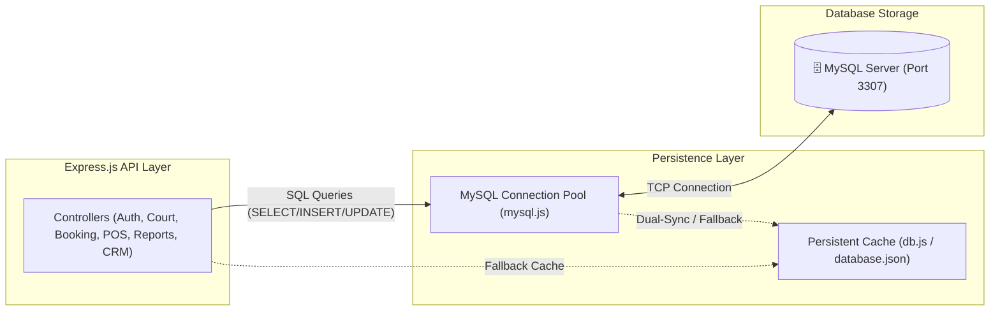

# Badminton Court Management & Booking - Backend API

Hệ thống RESTful API Server được xây dựng bằng **Node.js** và **Express.js**, phục vụ toàn bộ nghiệp vụ của ứng dụng đặt sân cầu lông và quản lý CLB thể thao.

---

## 🚀 Hướng dẫn Cài đặt & Chạy Server

### 1. Cài đặt Dependencies
```bash
cd backend
npm install
```

### 2. Chạy Server
- **Chế độ phát triển (Tự reload khi sửa code):**
  ```bash
  npm run dev
  ```
- **Chế độ bình thường:**
  ```bash
  npm start
  ```
Server sẽ chạy tại: `http://localhost:5000`

---

## 📡 Danh sách API Endpoints

### 1. Xác thực & Tài khoản (`/api/auth`)
- `POST /api/auth/login`: Đăng nhập (email/SĐT/password)
- `POST /api/auth/register`: Đăng ký tài khoản khách hàng mới
- `GET /api/auth/profile`: Lấy thông tin tài khoản hiện tại

### 2. Sân đấu & CLB (`/api/courts`)
- `GET /api/courts`: Danh sách tất cả sân đấu
- `GET /api/courts/:id`: Chi tiết 1 sân
- `GET /api/courts/clubs/all`: Danh sách câu lạc bộ
- `POST /api/courts`: Thêm sân đấu mới
- `PATCH /api/courts/:id/status`: Đổi trạng thái sân (`available`, `in_use`, `booked`, `maintenance`)
- `PATCH /api/courts/:id/price`: Cập nhật bảng giá sân

### 3. Đặt lịch & Duyệt đơn (`/api/bookings`)
- `GET /api/bookings`: Danh sách đơn đặt sân (hỗ trợ filter `?status=...&userId=...`)
- `GET /api/bookings/:id`: Chi tiết đơn đặt
- `POST /api/bookings`: Tạo đơn đặt sân mới
- `PATCH /api/bookings/:id/status`: Duyệt/Đổi trạng thái đơn
- `POST /api/bookings/:id/cancel`: Hủy đơn đặt sân

### 4. Khách hàng CRM & Hội viên (`/api/customers`)
- `GET /api/customers`: Danh sách hội viên / khách hàng
- `GET /api/customers/:id`: Chi tiết hồ sơ & lịch sử đặt của khách
- `POST /api/customers`: Thêm mới khách hàng
- `PATCH /api/customers/:id/toggle-status`: Khóa / Mở khóa tài khoản
- `PATCH /api/customers/:id/role`: Phân quyền vai trò (`admin`, `manager`, `staff`, `customer`)

### 5. Dịch vụ & Kho hàng POS (`/api/services`)
- `GET /api/services`: Danh sách nước uống & phụ kiện POS
- `POST /api/services`: Thêm sản phẩm mới vào kho
- `PATCH /api/services/:id/stock`: Cập nhật số lượng tồn kho
- `POST /api/services/pos-checkout`: Lên đơn thu tiền trực tiếp tại quầy

### 6. Sổ quỹ & Giao dịch (`/api/transactions`)
- `GET /api/transactions`: Sổ quỹ thu chi
- `POST /api/transactions`: Ghi nhận khoản thu/chi thủ công

### 8. Đồng bộ & Trạng thái Cơ sở dữ liệu (`/api/sync` & `/api/db`)
- `GET /api/sync/health`: Kiểm tra kết nối MySQL 8.0 & bộ nhớ đệm
- `POST /api/sync/mysql`: Đồng bộ dữ liệu 2 chiều MySQL Server
- `POST /api/sync/reset`: Khôi phục cơ sở dữ liệu về mặc định ban đầu
- `GET /api/db/stats`: Thống kê số lượng bản ghi trong database

---

## 🗄️ Kiến Trúc Cơ Sở Dữ Liệu (MySQL + Local Cache Engine)



